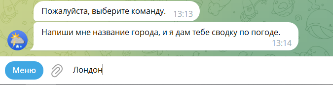

# Проект Simple_weather_info

Simple_weather_info - Это бот для Telegram, который информирует о погоде

## Установка

1. Клонируйте репозиторий из gitlab
2. Создайте виртуальное окружение
3. Установите зависимости `pip install -r requirements.txt`
4. Создайте файл `.env`
5. Впишите в `.env` переменные:

```
BOT_TOKEN="Ваш токен для бота, полученный от @BotFather"
WEATHER_API="Ваш ключ полученный по адресу https://home.openweathermap.org/api_keys"
```
6. Запустите бота командой `python main.py`

### Инструкция по работе с ботом:

Для запуска бота, вам будет необходимо создать виртуальное окружение. 
Поместить токен-бота и API-ключ rapidapi.com в переменные окружения (Файл .env). 
Далее запускаем бота в файле main.py. Для отслеживания функционирования бота
и возможных ошибок, ведётся логгирование, путём записи данных в файлы.
debug.log - записывает всю информацию, которая логируется в боте.

### Команды бота: 

1. /start - запуск бота, выбор языка для работы
2. /help — помощь по командам бота
3. /history — вывод истории запросов за определённый период

### Работа бота (Для примера взят русский язык)
Команда /start предоставит вам выбор одного из четырёх языков


Выбираем кнопку `Узнать погоду`


Выбираем интересующий период (для примера `Погода сейчас`)


Вводим название города



Получаем сводку по погоде в выбранном городе


На этом завершается работа данного запроса, 
и пользователю предоставляется выбор новой команды.